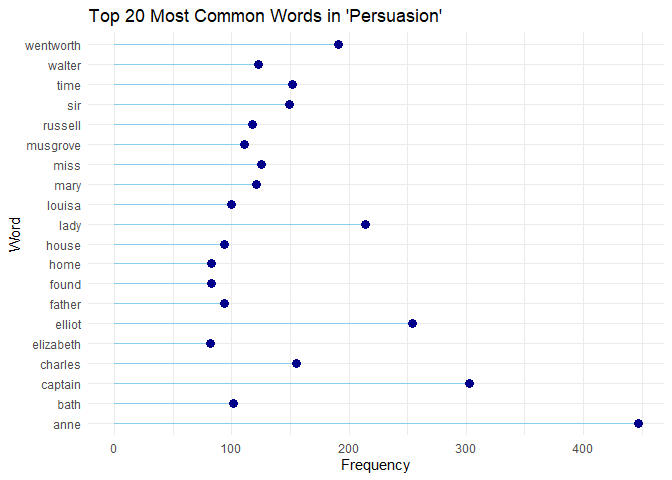

assignmentb4
================
Andras Szeitz
2023-11-27

Option A – Strings and functional programming in R

## Exercise 1

I will employ the tidytext package and stop_words dataset to remove the
most common stop words.

Installing the required packages.

``` r
# install.packages("janeaustenr")
# install.packages("stringi")
# install.packages("stringi", dependencies = TRUE, type = "source")
```

Loading the necessary packages.

``` r
library(janeaustenr)
library(stringi)
library(tidytext)
library(stringr)
library(tidytext)
library(dplyr)
```

    ## 
    ## Attaching package: 'dplyr'

    ## The following objects are masked from 'package:stats':
    ## 
    ##     filter, lag

    ## The following objects are masked from 'package:base':
    ## 
    ##     intersect, setdiff, setequal, union

``` r
library(ggplot2)
```

Selecting and loading the book titled Persuasion.

``` r
text <- austen_books() %>%
  filter(book == "Persuasion")
head(text)
```

    ## # A tibble: 6 × 2
    ##   text          book      
    ##   <chr>         <fct>     
    ## 1 "Persuasion"  Persuasion
    ## 2 ""            Persuasion
    ## 3 ""            Persuasion
    ## 4 "by"          Persuasion
    ## 5 ""            Persuasion
    ## 6 "Jane Austen" Persuasion

Breaking up the text into individual words.

``` r
words <- text %>%
   unnest_tokens(word, text)
words
```

    ## # A tibble: 83,658 × 2
    ##    book       word      
    ##    <fct>      <chr>     
    ##  1 Persuasion persuasion
    ##  2 Persuasion by        
    ##  3 Persuasion jane      
    ##  4 Persuasion austen    
    ##  5 Persuasion 1818      
    ##  6 Persuasion chapter   
    ##  7 Persuasion 1         
    ##  8 Persuasion sir       
    ##  9 Persuasion walter    
    ## 10 Persuasion elliot    
    ## # ℹ 83,648 more rows

Remove the stop words using stop_words dataset.

``` r
data("stop_words")
filtered_words <- words %>%
  anti_join(stop_words, by = "word")
filtered_words
```

    ## # A tibble: 25,488 × 2
    ##    book       word      
    ##    <fct>      <chr>     
    ##  1 Persuasion persuasion
    ##  2 Persuasion jane      
    ##  3 Persuasion austen    
    ##  4 Persuasion 1818      
    ##  5 Persuasion chapter   
    ##  6 Persuasion 1         
    ##  7 Persuasion sir       
    ##  8 Persuasion walter    
    ##  9 Persuasion elliot    
    ## 10 Persuasion kellynch  
    ## # ℹ 25,478 more rows

Counting and sorting the words.

``` r
word_counts <- filtered_words %>%
  count(word, sort = TRUE)
word_counts
```

    ## # A tibble: 5,340 × 2
    ##    word          n
    ##    <chr>     <int>
    ##  1 anne        447
    ##  2 captain     303
    ##  3 elliot      254
    ##  4 lady        214
    ##  5 wentworth   191
    ##  6 charles     155
    ##  7 time        152
    ##  8 sir         149
    ##  9 miss        125
    ## 10 walter      123
    ## # ℹ 5,330 more rows

Generating a lolly-pop plot for the top 20 most common words.

``` r
# Assuming 'word_counts' is a data frame with 'word' and 'n' columns
top_words <- head(word_counts, 20)

# Create a lollipop plot
library(ggplot2)

ggplot(top_words, aes(x = reorder(word, n), y = n)) +
  geom_segment(aes(x = word, xend = word, y = 0, yend = n), color = "skyblue") +
  geom_point(color = "darkblue", size = 3) +
  labs(title = "Top 20 Most Common Words in 'Persuasion'",
       x = "Word",
       y = "Frequency") +
  theme_minimal() +
  coord_flip()
```

<!-- -->

## Exercise 2

Making a function that converts words to my version of Pig Latin.

``` r
#' Converting to Custom Pig Latin
#'
#' This function converts English words to my version of Pig Latin.
#' The rearrangement involves moving the first letter of the word to the end, #' and the last letter of the word to the beginning and adding "bla" to the
#' end.
#'
#' @param word A character string representing a single English word.
#' @return A character string of the word converted to custom Pig Latin.
#' @examples
#' custom_pig_latin("flower")
#' custom_pig_latin("summer")
#' custom_pig_latin("happy")
#' @export
custom_pig_latin <- function(word) {
  # Validating the input
  if (!is.character(word) || length(word) != 1) {
    stop("Input must be a single word (character string).")
  }

  if (nchar(word) == 0) {
    return("bla")
  }

  # Checking if word starts with a vowel
  if (tolower(substr(word, 1, 1)) %in% c('a', 'e', 'i', 'o', 'u')) {
    # Moving the last letter to the start and add "bla"
    return(paste0(substr(word, nchar(word), nchar(word)), substr(word, 1, nchar(word) - 1), "bla"))
  } else {
    # Moving the first letter to the end, then the last to the start, and add "bla"
    return(paste0(substr(word, nchar(word), nchar(word)), substr(word, 2, nchar(word) - 1), substr(word, 1, 1), "bla"))
  }
}
```

Presenting an example

``` r
custom_pig_latin("flower") # "rlowefbla"
```

    ## [1] "rlowefbla"

``` r
custom_pig_latin("summer") # "rummesbla"
```

    ## [1] "rummesbla"

``` r
custom_pig_latin("happy") # "yapphbla"
```

    ## [1] "yapphbla"

the test function

``` r
library(testthat)
```

    ## 
    ## Attaching package: 'testthat'

    ## The following object is masked from 'package:dplyr':
    ## 
    ##     matches

``` r
# Begining test cases
test_that("Custom Pig Latin Conversion Works Correctly", {
  expect_equal(custom_pig_latin("flower"), "rlowefbla")
  expect_equal(custom_pig_latin("summer"), "rummesbla")
  expect_equal(custom_pig_latin("happy"), "yapphbla")
})
```

    ## Test passed 😸

``` r
test_that("Handles Non-Standard Input", {
  expect_error(custom_pig_latin(123))
  expect_error(custom_pig_latin(TRUE))
  expect_error(custom_pig_latin(NULL))
})
```

    ## Test passed 😸

``` r
test_that("Handles Empty and Single Character Strings", {
  expect_equal(custom_pig_latin(""), "bla")
  expect_equal(custom_pig_latin("a"), "abla")
})
```

    ## Test passed 🌈
